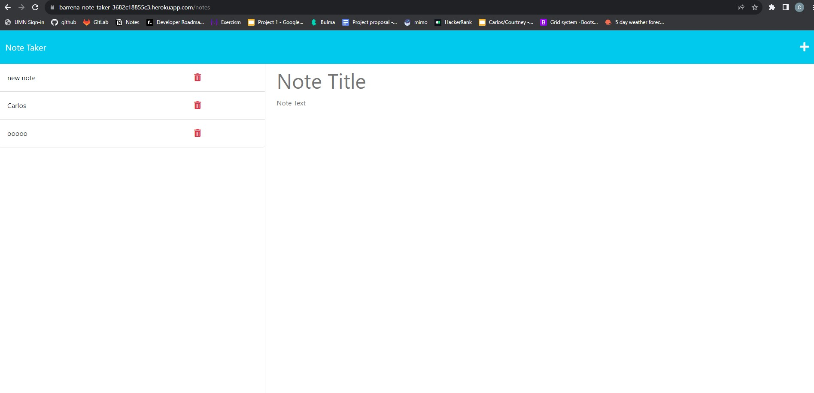

# Note Taker Express.js

## Description

The Note Taker app allows the user to write and save notes in order to help with organizing tasks to complete.
​
## Table of Contents 
​
* [Usage](#usage)
​
* [License](#license)
​
​
​
## Usage
​To use this Note Taker App the user has to click the 'Get Started' button on the home page, then type in a new note and note content and click the save icon. Once this is done, the new note will populate on the left hand column. If the user wants to bring up a previously created note, they can simply click on the note on the left column and the content will populate on the right column. The user can also click the '+' icon to create a new note again.

[Note Taker Webpage](https://barrena-note-taker-3682c18855c3.herokuapp.com/notes)

## License
​
This project is licensed under the MIT license.
  

## Tests
​
N/A
​